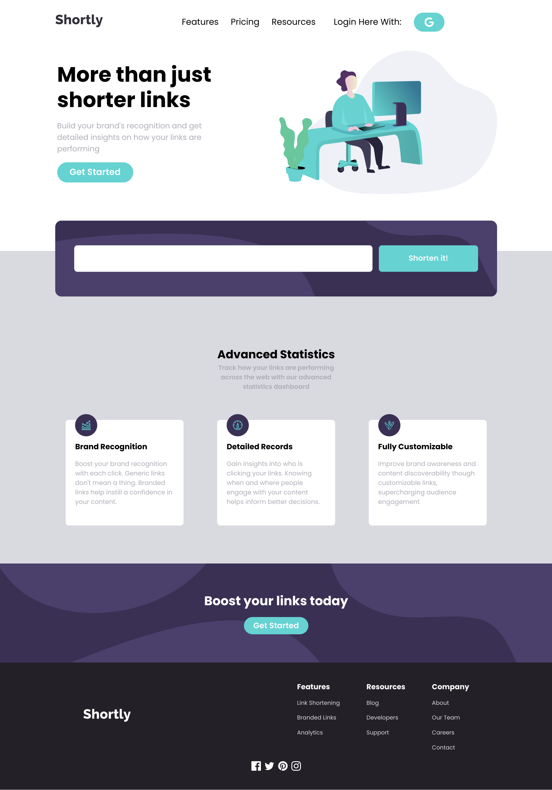
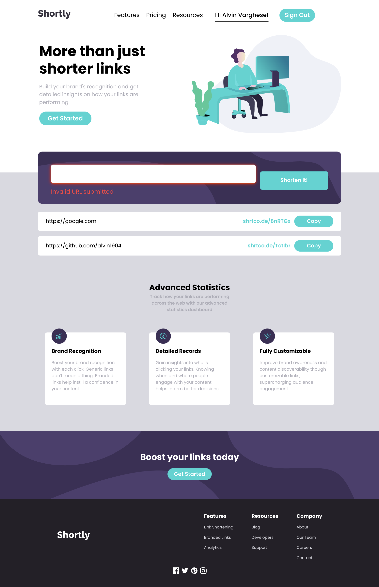
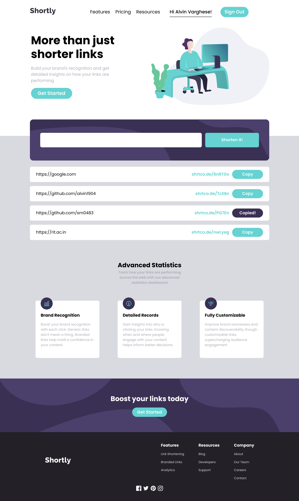
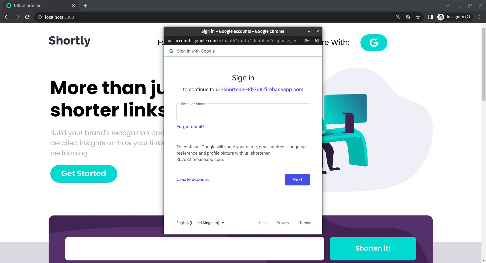

# URL-shortener

This website integrates with shrtcode API to create shortened URLs and display them like in the screenshots.

## Features

- View the optimal layout for the site depending on their device's screen size
- Shorten any valid URL
- See a list of their shortened links, backed up the Google firestore database
- The users can login via Google and save their shortened links
- Copy the shortened link to their clipboard in a single click

## Tech Stack

**Client:** React, plain CSS

**Server:** 3rd party API: shrtcode API

## Screenshots

 

 

 

